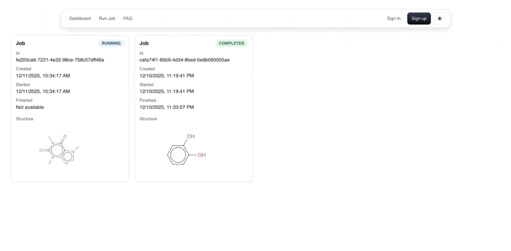

# MetaXime

This projects makes it more accessible to study the output of RetroPath2.0 by converting the results to metabolic models for downstream analysis. 

## Dependencies

[BioPathOpt](https://github.com/melclic/bioPathOpt)

## Introduction

This project parses the output of [RetroPath2.0](https://www.myexperiment.org/workflows/4987/versions/16.html) and completes the monocomponent reactions of the tool to full reactions. This includes all the cofactors that makes the reaction complete and extracts them to a cobrapy metabolic model. This includes a sink and source to enable the user to simulate the production of the molecule. The project also has the ability to merge two models together, and works seamlessly with the [retrosynthesis](https://github.com/melclic/retrosynthesis). 

This is part of one of the projects that may be found [here](https://github.com/brsynth) and lives as a [Galaxy platform](https://galaxy-synbiocad.org/). The point of this project is to use an alternative method and enable researchers to use other workflow tools to run the design pipeline. It essentially does the same thing as [rpCompletion](https://github.com/brsynth/rptools/blob/master/rptools/rpcompletion/README.md) from [rptools](https://github.com/brsynth/rptools).

## Usage

### Frontend

This project contains a frontend app written in React that enables the less technical users to use it. Please refer to this [README](webapp/README.md)



### Docker

If using Docker, the image `melclic/metaxime:latest` can de used to run the pipeline.

```
docker pull melclic/metaxime:latest
```

You can build it yourself with:
```
docker build -t melclic/metaxime:latest -f Dockerfile .
```

## Command Line Arguments

Within the docker you can use

```bash
python run_pipeline.py \
    --scope notebooks/data/out_scope.csv \
    --compounds notebooks/data/out_compounds.csv \
    --paths notebooks/data/out_paths.csv \
    --target_model iML1515.xml \
    --out_tar merged_rp2_models.zip \
    --source_comp c \
    --target_comp c \
    --use_inchikey2 \
    --find_all_parentless
```

### Required Arguments

#### --scope <path>
Path to `out_scope.csv`.

#### --compounds <path>
Path to `out_compounds.csv`.

#### --paths <path>
Path to `out_paths.csv`.

#### --target_model <path>
COBRA SBML model into which each RP2 pathway model will be merged.

#### --out_tar <path>
Path to the resulting ZIP archive.

### Optional Arguments

#### --source_comp <id>
Compartment ID expected in RP2 models. Default: `c`

#### --target_comp <id>
Compartment ID in the target COBRA model. Default: `c`

#### --use_inchikey2
Enable fallback metabolite matching using the first two blocks of the InChIKey.

#### --find_all_parentless
Do not include merged models where the parentless metabolites in the original model cannot be found in the target model.
This would cause the flux to be 0 if trying top optimize for the target.

## Output

A single ZIP archive containing all merged SBML models.

## Running via Nextflow

To run using nextflow, you can use:

```bash
nextflow run main.nf \
    --scope notebooks/data/out_scope.csv \
    --compounds notebooks/data/out_compounds.csv \
    --paths notebooks/data/out_paths.csv \
    --target_model iML1515.xml \
    --out_tar results/merged_rp2_models.zip \
    --source_comp c \
    --target_comp c \
    --use_inchikey2 \
    --find_all_parentless \
    -with-docker
```

## Example Run

To use the command line directly, you can use:

```bash
python run_pipeline.py \
    --scope notebooks/data/out_scope.csv \
    --compounds .notebooks/data/out_compounds.csv \
    --paths notebooks/data/out_paths.csv \
    --target_model models/iML1515.xml \
    --out_tar output/merged.zip \
    --use_inchikey2 \
    --find_all_parentless
```
