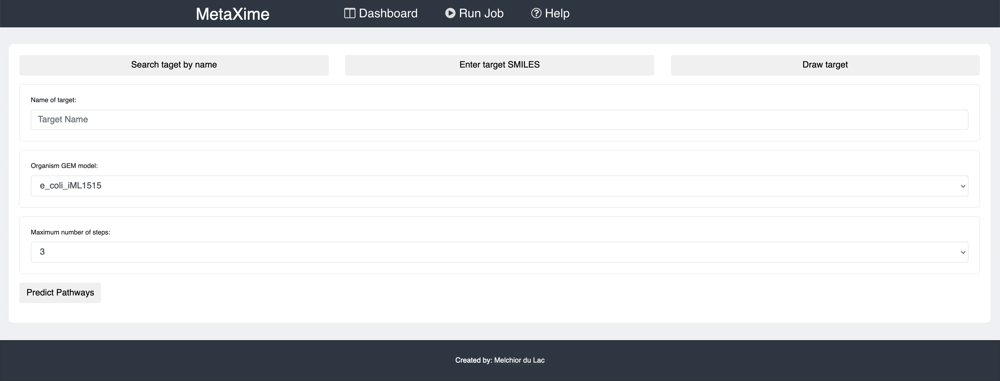
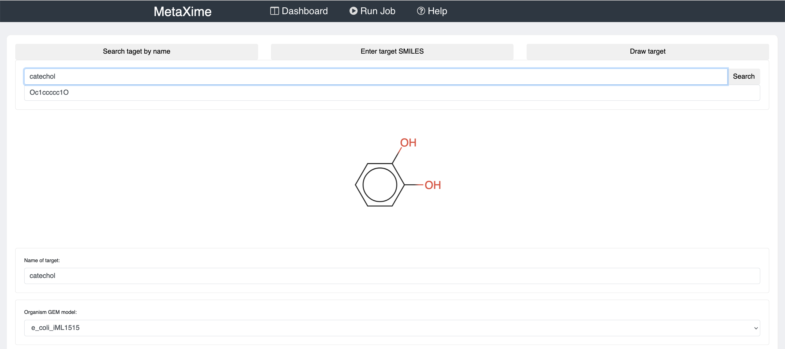
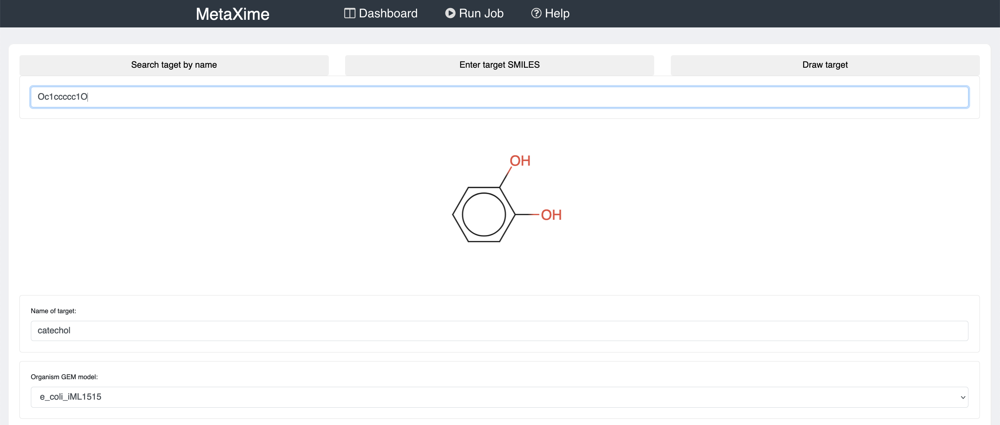
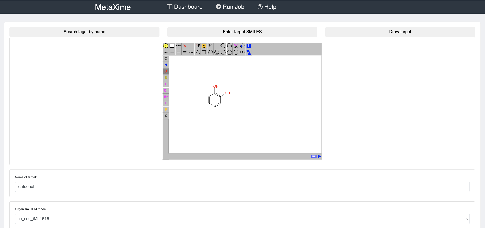
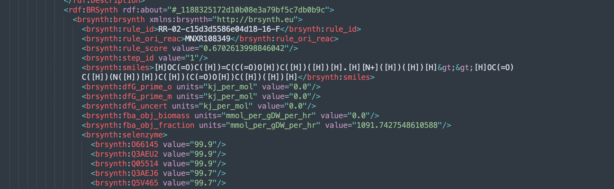
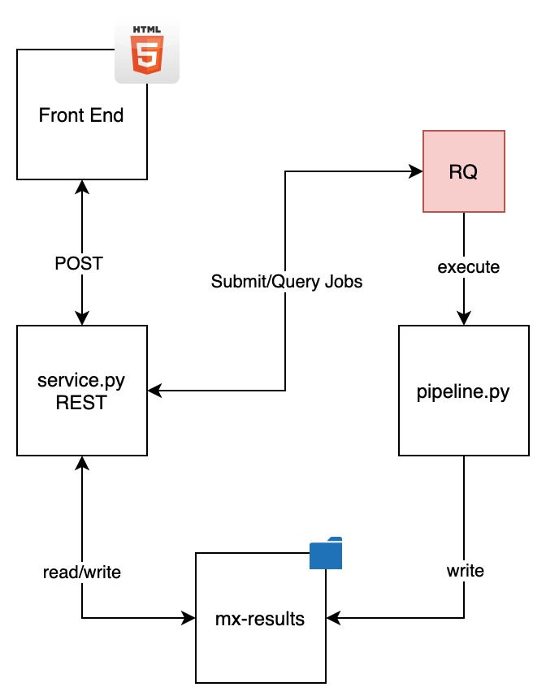

# MetaXime

WARNING: Non-functional. Requires separating all the individual modules into individual dockers is the way to go (perhaps CWL)

## Introduction

Predict heterologous metabolic pathways to produce a compound of interest in a strain of interest. 

The following SBML models are supported:

* [B.Subtilis iYO844](http://bigg.ucsd.edu/models/iYO844)
* [E.Coli iJO1366](http://bigg.ucsd.edu/models/iJO1366)
* [P.Putida iJN746](http://bigg.ucsd.edu/models/iJN746)
* [E.Coli core model](http://bigg.ucsd.edu/models/e_coli_core)
* [E.Coli iJR904](http://bigg.ucsd.edu/models/iJR904)
* [S.Serevisiae iMM904](http://bigg.ucsd.edu/models/iMM904)
* [E.Coli iAF1260](http://bigg.ucsd.edu/models/iAF1260)
* [Y.Lipolytica iMK735](https://www.ebi.ac.uk/biomodels/MODEL1510060001)
* [S.Cerevisiae iND750](http://bigg.ucsd.edu/models/iND750)
* [E.Coli iML1515](http://bigg.ucsd.edu/models/iML1515)

This project is a concatenation of different projects that may be found at the following [here](https://github.com/galaxy-synbiocad):

* [RetroRules](https://github.com/galaxy-synbiocad/RetroRules): Generate a collection of reaction rules that are used by RetroPath2
* [RetroPath2](https://github.com/galaxy-synbiocad/RetroPath2): Given a target and a collection of sinks, predict the possible chemical routes between the two.
* [rp2Paths](https://github.com/galaxy-synbiocad/rp2paths): From the metabolic network generated by RetroPath2, separate the individual metabolic routes between one or more sinks and the target molecule.
* [rpBase](https://github.com/galaxy-synbiocad/rpBase): Project that contains the base project to manipulate the enriched version of SBML files developed here. This project is the base project on which the others are based on.
* [rpCache](https://github.com/galaxy-synbiocad/rpCache): Generate the data lake of molecules and reactions to enrich SBML files.
* [rpReader](https://github.com/galaxy-synbiocad/rpReader): Parse the output of RetroPath2 and convert to SBML files
* [rpCofactors](https://github.com/galaxy-synbiocad/rpCofactors): From the mono-component reactions generated by RetroPath2, try to add the missing cofactors
* [rpThermo](https://github.com/galaxy-synbiocad/rpThermo): Calculate the thermodynamics of predicted reactions and pathways. Based on the [equilibrator](https://equilibrator.weizmann.ac.il/) project.
* [rpMergeSBML](https://github.com/galaxy-synbiocad/rpMergeSBML): Merge two SBML files together. Required step to calculate the FBA of a predicted pathway from RetroPath2 and its host organism
* [rpFBA](https://github.com/galaxy-synbiocad/rpFBA): Calculate the FBA of the target chemical using the [cobrapy](https://opencobra.github.io/cobrapy/) package.
* [rpSenlenzyme](https://github.com/galaxy-synbiocad/rpSelenzyme): Return enzyme candidates for all predicted reactions. Based on the following [project](http://selenzyme.synbiochem.co.uk/).

These individual projects are chained together in a galaxy interface implemented [here](https://galaxy-synbiocad.org/). 

> Note: Development of the tools has now switched to the [following repository](https://github.com/brsynth).

## How to run 

To predict metabolic pathways, click on "Run Job" on the top banner. 



There you will need to provide the molecule that you would like to produce, the organism in which you would like to produce the molecule of interest, and the maximum number of reactions that the pathways may have.





The results may be inspected once the job is completed. The following error 

## Build

To build the project, navigate to the project folder and run the following commands:

```
docker build -t metaxime -f Dockerfile .
docker run -it -v $(pwd)/mx-results:/mx-results -p 80:80 -p 8888:8888 metaxime
```

The results should be accessible at: `http://localhost:80`

## Structure

This project may be separated into three different parts, the retrosynthesis part to predict new pathways, the pathway analysis and the front end of the project

### RetroSynthesis

These include [RetroPath2](https://myexperiment.org/workflows/4987.html), [rp2paths](https://github.com/brsynth/rp2paths) and [RetroRules](https://retrorules.org/). (TODO: finish separating that part into its own docker and API service: https://github.com/Melclic/retrosynthesis). 

RetroPath2 is a [KNIME](https://www.knime.com/) workflow and requires the installation of the workflow execution environment to enable its execution. Rp2paths is a python package and RetroRules is a database of reaction rules. The script in this project parses database and extracts only information that is to be used in a particular execution (see reaction rule diameters. More info [here](https://www.jfaulon.com/retropath2-0-a-retrosynthesis-workflow-for-metabolic-engineers-biorxiv/)).   

### Pathway Analysis

The pathway analysis part of the project may be found under the metaxime/ folder and is the central part of this project. It contains all the scripts that parse the output of RetroPath2 and rp2paths and turn them into [SBML](https://en.wikipedia.org/wiki/SBML) metabolic model files. This project supports the [MIRIAM](https://en.wikipedia.org/wiki/Minimum_information_required_in_the_annotation_of_models) standard for SBML files, that contains the annotations for species, reactions and pathways to link these properties of a metabolic model to various databases.

We call "rpSBML" SBML files that are enriched to contain extra information related to the heterologous pathway. This includes the thermodynamic properties of the chemical species, reaction and pathways. It also holds the FBA run information and any extra annotation related to chemoinformatics properties of the predicted reactions.



More detail on each of these files may be found in the various github projects described in the top of this README.

### Front End and Architecture

The architecture of the project as follows:



The output of a run is a compressed file named `rpcollection.tar.xz`. This contains the enriched SBML models, the model JSON's and the model networks used to graphically render them on the front end. 

```
├── log.json
├── model_json
│   └── rp_*_rpsbml.json
├── models
│   └─── rp_*_rpsbml.xml
└── networks
    └── rp_*_rpsbml.json
```

The web interface (in the static/ folder) contains all the JS and HTML. The `draw_network.js` renders the network JSON of the parsed SBML by [networkX](https://networkx.org/) and renders it on the page using the [dagre-d3](https://github.com/dagrejs/dagre-d3) project. 

Rendering the molecules in javascript is done by a branched project called [smiledDrawer](https://github.com/Melclic/smilesDrawer).
